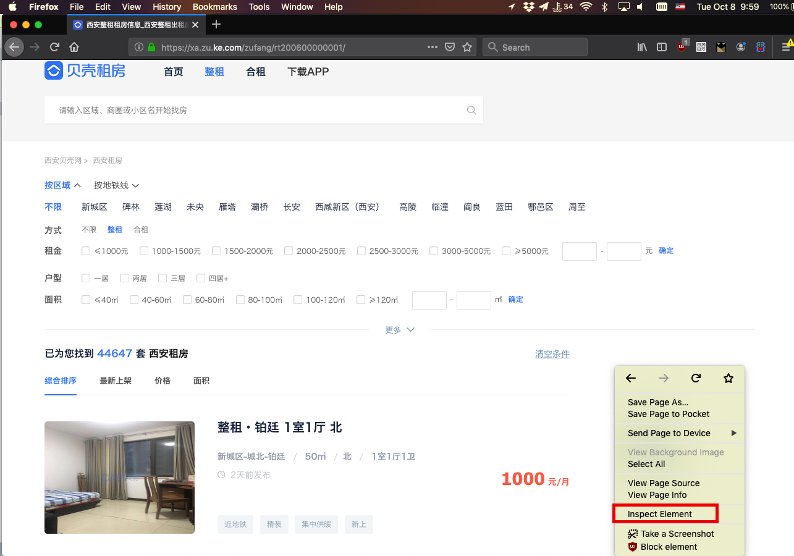

# Just Dwell It.  
&nbsp;&nbsp;&nbsp;&nbsp; Dwell is an application which can make it easier to find the good places to rent and to dwell in Xi'an City according to a few steps on <b>Data Visualization</b>. Now I'm going to code for learning new skills, sharing tips, and providing values for the city in my way. I hope you'll gonna like this.  

## Make the Plan.   
+ There're 4 main steps in the project. <b>Fetch</b> DataSource + <b>Save</b> Records + <b>Query</b> Records + <b>Display</b> Result.  
+ Manage the development in [Trello](https://trello.com)  including push-notifications from Continuous Integration server.
+ Base on Java [Spring Boot](https://spring.io/projects/spring-boot) as backend. &nbsp; [Amazon Corretto 8](https://aws.amazon.com/blogs/opensource/amazon-corretto-no-cost-distribution-openjdk-long-term-support/)  (An OpenJDK-8 for avoiding the affairs of copyright in legal)  
+ Base on [React.js](https://reactjs.org/) as frontend for displaying.  


### 1. Fetch
&nbsp;&nbsp;&nbsp;&nbsp;[贝壳租房](https://xa.ke.com/) may shares the largest marketing in real estate websites in China and it has millions of real estate info on its platform. I'd like to fetch the data-source from right [here](https://xa.zu.ke.com/zufang) .  

- 1.1 Analyse the web-elements on data-source website in browser.  
&nbsp;&nbsp;&nbsp;&nbsp;&nbsp;&nbsp; I prefer FireFox that can help developers saving much time, by the way, google-chrome is a better option. At first, let's right click the mouse after the target website loaded, then select <b>[Inspect Element]</b> from the sheet-menu, and the window page will be rendered by source code of HTML-elements in Inspector-View. Thanks to the high-lighted color on Inspector-View, we can easily locate every text-element on the source code while just following the content which on the website.  
<p><p>

<p><p>

<p><p>


- 1.2 Using Web-Spider to Fetch.  
&nbsp;&nbsp;&nbsp;&nbsp;&nbsp;&nbsp; Python will be an excellent way for handing with web-crawler/spider in recently, but I've never token python for the project as backend programming language before. Considering in time-consuption and python-starter, I chose java as the programming language for backend and [Crawler4j](https://github.com/yasserg/crawler4j) as web-spider in the end.  


- 1.3 Format the value of all target elements.  
&nbsp;&nbsp;&nbsp;&nbsp;&nbsp;&nbsp; Different types of result values will be reformat in String-Type during DOM-Formating, because there are still serval steps for data persistence in database.


- 1.4 Parse the target DOM.  
&nbsp;&nbsp;&nbsp;&nbsp;&nbsp;&nbsp; DOM is Document-Object-Model and I chose [Jsoup](https://jsoup.org/) as the DOM-Parsing-Utils in project.


### 2. Save
&nbsp;&nbsp;&nbsp;&nbsp;We can get the result as text-content when the fetched DOM of data-source be parsed, and we need to mapping the result into the database which can provid data persistence and query services. It means that we can only focus on the operations of programming-language-layer and we don't need to take care of the data persistence by ourselves.  

- 2.1 Setup database environment  
  &nbsp;&nbsp;&nbsp;&nbsp;&nbsp;&nbsp; Unix/Linux is much better for developers for handling with the command-line during the development. My IDE is based on Mac and I'm highly recommend you [HomeBrew](https://brew.sh/) as your management utils of command-line on Mac because everything in homebrew is done as simple and easy as it does.

  ```
      brew install mysql@5.7      						//  Install the target-version of MySQL in '@' in homebrew-commandline
  ```

#### Tips:  


