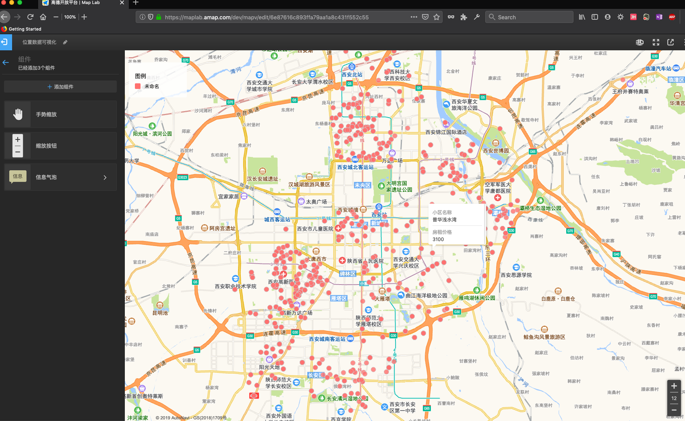

# Just Dwell It.  
&nbsp;&nbsp;&nbsp;&nbsp; [Dwell](https://maplab.amap.com/share/mapv/6e87616c893ffa79aa1a8c431f552c55) is an application which can make it easier to find the good places to rent and to dwell in Xi'an City according to a few steps on <b>Data Visualization</b>. Now I'm going to code for learning new skills, sharing tips, and providing values for the city in my way. I hope you'll gonna like this.  

+ [Here is the result of Dwell-backend-project](https://maplab.amap.com/share/mapv/6e87616c893ffa79aa1a8c431f552c55)

+ [Here is the result of Dwell-frontend-project](https://github.com/toureek/dwell-reactjs)


## Make the Plan.   
+ There're 3 main steps in server-project. <b>Fetch</b> DataSource + <b>Parse</b>  DOM + <b>Save</b> Records.  
+ 基于高德地图SDK，由地址信息反向解析获取坐标，剔除数据库脏数据后，借助高德开放平台的数据可视化接口予以显示。  
+ Manage the development in [Trello](https://trello.com)  including push-notifications from Continuous Integration server.
+ Base on Java [Spring Boot](https://spring.io/projects/spring-boot) as backend. &nbsp; [Amazon Corretto 8](https://aws.amazon.com/blogs/opensource/amazon-corretto-no-cost-distribution-openjdk-long-term-support/)  (An OpenJDK-8 for avoiding the affairs of copyright in legal)  
+ Base on [React.js](https://reactjs.org/) as frontend for displaying.  


## Programming Details.  
+ [Backend-Java](Backend.md). 

+ [Frontend-React.js](https://github.com/toureek/dwell-reactjs). 

+ [Mobile](https://github.com/toureek/dwell-ios).  

+ [Java Tips](Tips.md).

+ [Construct Ajax-Request for dynamic-rendered content](Ajax.md).  

+ [API FlowChart](API.md).  


## Summary.
&nbsp;&nbsp;&nbsp;&nbsp;&nbsp;&nbsp;&nbsp;&nbsp; 由于Dwell用到了网页爬虫来获取页面数据，python这两年太火热了，原本一开始也是打算使用Python的，但目前还没写过Python，考虑到时间成本，想想不如用Java来实现后端，顺便能把Java语言通过项目好好实践一下。我在后端项目开发的过程中，对爬虫很感兴趣，也阅读了大量爬虫相关的内容，尝试对爬虫获取数据这部分业务功能进行有针对性优化，结合项目的实现思路，写完代码后在这里也记录一下，如有错误，请予以指正。

+ 爬虫是基于【图论】的遍历  
&nbsp;&nbsp;&nbsp;&nbsp;可能看到【图】这个数据结构，人们脑中第一印象就是深度优先算法(DFS 简单理解是一条路走到底，走不动的时候再返回回去，从分叉的路接着往下走，再次走到底，循环这样的方法，直到把所有的分叉路全部走完结束)或者广度优先算法(BFS 简单理解是尽可能‘广’地把每个节点直接相连的几个节点访问一遍，直到直接相连的节点被遍历完，再遍历间接相连的节点，循环使用这样的方法，直到把所有节点访问完)。关于图，还有有向图，无向图的区分（微博、朋友圈的好友关系、可能认识的人等）<p>
+ 爬虫要避免访问重复的页面（HashTable)  
&nbsp;&nbsp;&nbsp;&nbsp;使用HashMap这个数据结构，用来存储已经访问过的url，因为页面url是唯一的。但在Dwell项目中，url不直接作为key使用,而是先md5处理一下，使原始很长的url哈希为16字节大小，3000条数据的key任何电脑都可以直接读取。如果数据量大到上亿条时，不建议使用HashMap，因为Map有装载因子，虽然天然支持动态扩容(基于链表)，实际使用时内存占用更大。这时可以考虑将访问记录分散在10000个文件中，每个文件最大500Mb, 让URL先hash再对10000去模运算，得到的结果就是url应保存的文件编号然后依次对10000个数据进行处理，这样即使单台机器内存只有1GB,也可以使用这种方法处理数据。(与load-balance的处理思路类似)<p>
+ 爬虫实现过程中需要工程素养  
    -  从0开始要实现一个爬虫，实际上综合考验着一个人对于计算机科学理论基础、算法能力、工程素养等很多方面。针对爬虫来解决的主要问题，清晰地定义是【<b>如何在有限的时间内，尽可能多地获得更重要的网页信息？</b>】 所以，尽管DFS与BFS都可以完成爬取任务，但显然在实际项目中BFS更多的会被优先选用（设想：给你一张报纸，你要发现今天的重大新闻，肯定会是先粗略地看一下每版的标题，再细看文章的），但是不全以偏概全，爬虫爬取数据的算法，更多情况应该是<b>按照一个复杂的优先级队列，来按需分配下载页面的前后顺序的</b>
    -  TCP的通信成本太高(因为它的请求不是一条路走到底的)，如果握手次数太多，爬虫的下载效率就降低了。大多数情况，爬虫是一台或者多台服务器组成的分布式系统，对于某个特定的网页，一般是被特定的一台或者几台机器访问的，它们应该是独立的下载服务器，单独就做fetching这一件事。
    -  页面数据的分析与URL的获取： 随着网页技术的发展，web上已经不再是纯静态数据了(HTML)，更多的时候，是需要让浏览器打开页面，并运行一些脚本，动态生成数据展示的。这就需要我们动态的获取请求链接(javascript, ajax等)，有时候还需要爬虫来模拟浏览器的环境访问url。因为页面上的脚本存在很多不规范的地方，所以，有极端的情况，需要浏览器内核工程师对页面进行解析。有时候爬虫没获取到数据，可能是没有成功解析网页上那些不规范的脚本程序。
    -  访问重复的页面: 如果有上千台服务器一起下载网页，那么维护一张统一的哈希表就不是一个容易的问题了。首先，这张哈希表可能非常大，大到一台机器根本存放不下，其次上千台机器同时要维护这张哈希表，那么存储这张哈希表的服务器的通信就成了整个爬虫系统的瓶颈。：
    -  该如何消除这样的瓶颈： 首先，使用哈希算法对url做hash,并对机器的数量取模，得到的结果就是该url对应的机器编号，以此明确每台机器的分工，也就是爬虫系统看到一个url时，就已经知道应该让第几号机器去爬取，避免了很多服务器看到一个url后，对同一个url作出是否需要下载的判断。 其次，在明确分工的基础上，减少通信次数，降低通信成本的开销，使用批处理，一次批量操作一大批哈希表更新的请求。（JVM的垃圾标记、回收算法思路雷同）  

+ TODO: 还要注意 如何去反爬虫

# GitHub Open API

```
# GitHub searching API list:
 
 {
     "current_user_url": "https://api.github.com/user",
     "current_user_authorizations_html_url": "https://github.com/settings/connections/applications{/client_id}",
     "authorizations_url": "https://api.github.com/authorizations",
     "code_search_url": "https://api.github.com/search/code?q={query}{&page,per_page,sort,order}",
     "commit_search_url": "https://api.github.com/search/commits?q={query}{&page,per_page,sort,order}",
     "emails_url": "https://api.github.com/user/emails",
     "emojis_url": "https://api.github.com/emojis",
     "events_url": "https://api.github.com/events",
     "feeds_url": "https://api.github.com/feeds",
     "followers_url": "https://api.github.com/user/followers",
     "following_url": "https://api.github.com/user/following{/target}",
     "gists_url": "https://api.github.com/gists{/gist_id}",
     "hub_url": "https://api.github.com/hub",
     "issue_search_url": "https://api.github.com/search/issues?q={query}{&page,per_page,sort,order}",
     "issues_url": "https://api.github.com/issues",
     "keys_url": "https://api.github.com/user/keys",
     "label_search_url": "https://api.github.com/search/labels?q={query}&repository_id={repository_id}{&page,per_page}",
     "notifications_url": "https://api.github.com/notifications",
     "organization_url": "https://api.github.com/orgs/{org}",
     "organization_repositories_url": "https://api.github.com/orgs/{org}/repos{?type,page,per_page,sort}",
     "organization_teams_url": "https://api.github.com/orgs/{org}/teams",
     "public_gists_url": "https://api.github.com/gists/public",
     "rate_limit_url": "https://api.github.com/rate_limit",
     "repository_url": "https://api.github.com/repos/{owner}/{repo}",
     "repository_search_url": "https://api.github.com/search/repositories?q={query}{&page,per_page,sort,order}",
     "current_user_repositories_url": "https://api.github.com/user/repos{?type,page,per_page,sort}",
     "starred_url": "https://api.github.com/user/starred{/owner}{/repo}",
     "starred_gists_url": "https://api.github.com/gists/starred",
     "topic_search_url": "https://api.github.com/search/topics?q={query}{&page,per_page}",
     "user_url": "https://api.github.com/users/{user}",
     "user_organizations_url": "https://api.github.com/user/orgs",
     "user_repositories_url": "https://api.github.com/users/{user}/repos{?type,page,per_page,sort}",
     "user_search_url": "https://api.github.com/search/users?q={query}{&page,per_page,sort,order}"
 }

```

